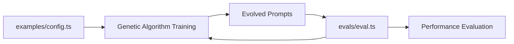

# Evals Directory

This directory contains evaluation configurations that serve as the **single source of truth** for all prompt evaluation logic in PromptGen.

## Purpose

The `evals/` directory defines evaluation logic that is used by **both**:

- **Genetic algorithm training** (automatic evaluation during evolution)
- **Manual testing** (standalone evaluation using Evalite framework)

Each eval includes:

- Test cases for evaluation
- Scoring functions
- Integration with Evalite framework

## Directory Structure

```
evals/
├── README.md                           # This file
└── intent-classification/
    └── intent-classification.eval.ts   # Evalite evaluation configuration
```

## How Evals Work with Examples

The `evals/` directory works in conjunction with the `examples/` directory:

1. **Configuration Phase** (`examples/`): Define training parameters and test cases
2. **Evaluation Phase** (`evals/`): Define evaluation logic (used by both GA and manual testing)

### Workflow



**Key Point**: The genetic algorithm automatically uses the evaluation logic from `evals/` during training, ensuring consistency between training and testing phases.

## Running Evals

To run evaluations:

```bash
# Run all evals
npm run eval

# Serve eval results
npm run eval:serve

# Watch for changes
npm run eval:watch
```

## Eval Structure

Each eval file should follow this structure:

```typescript
import { evalite } from "evalite";

evalite("Task Name", {
  data: testCases,
  task: async (input) => {
    // Prompt evaluation logic
    return result;
  },
  scorers: [
    {
      name: "accuracy",
      scorer: (output, expected) => {
        // Scoring logic
        return score;
      },
    },
  ],
});
```

## File-Based Evals

PromptGen now supports file-based evaluations for testing prompts against multiple documents:

### Example: Article Summary Eval

```typescript
// evals/article-summary/article-summary.eval.ts
export const articleSummaryEval: FileBasedEvalConfig = {
  name: "Article Summary",
  inputFiles: [
    "data/articles/climate-change.txt",
    "data/articles/nutrition-guide.txt", 
    "data/articles/travel-tips.txt",
    "data/articles/financial-advice.txt",
    "data/articles/health-wellness.txt"
  ],
  expectedOutputs: [
    "Climate patterns are changing globally, affecting weather and ecosystems",
    "Balanced diet with whole foods, lean proteins, and vegetables promotes health",
    "Research destinations, book early, pack light, and embrace local culture",
    "Save regularly, diversify investments, and plan for long-term goals",
    "Regular exercise, good sleep, and stress management are key to wellness"
  ],
  initialPrompt: "Summarize the main point of this article in one sentence",
  evaluationMethod: "semantic-similarity",
  outputDir: "results"
};
```

### Running File-Based Evals

```bash
npm run start -- --eval=article-summary
```

### Evaluation Methods

- **semantic-similarity**: Uses OpenAI embeddings to compare semantic meaning
- **llm-judge**: Uses GPT to evaluate output quality against expected result
- **exact-match**: String matching with partial credit for similar words

### Results

Results are saved to `results/<eval-name>-<timestamp>.json` with:
- Initial prompt score
- Hall of fame (best evolved prompts)
- Evolution statistics
- Generation-by-generation progress

## Adding New Evals

To add a new eval:

1. Create a new directory under `evals/`
2. Add an `*.eval.ts` file with evaluation configuration
3. Ensure test cases align with corresponding example
4. Add appropriate scoring functions

## Scoring Functions

Common scoring functions include:

- **Accuracy**: Exact match scoring
- **Partial Match**: Partial credit for close matches
- **Semantic Similarity**: Using embeddings for semantic matching
- **Custom Metrics**: Domain-specific scoring
