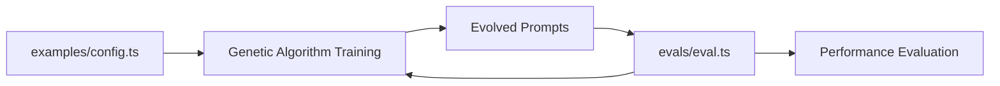

# Evals Directory

This directory contains evaluation configurations that serve as the **single source of truth** for all prompt evaluation logic in PromptGen.

## Purpose

The `evals/` directory defines evaluation logic that is used by **both**:
- **Genetic algorithm training** (automatic evaluation during evolution)
- **Manual testing** (standalone evaluation using Evalite framework)

Each eval includes:
- Test cases for evaluation
- Scoring functions
- Integration with Evalite framework

## Directory Structure

```
evals/
├── README.md                           # This file
└── intent-classification/
    └── intent-classification.eval.ts   # Evalite evaluation configuration
```

## How Evals Work with Examples

The `evals/` directory works in conjunction with the `examples/` directory:

1. **Configuration Phase** (`examples/`): Define training parameters and test cases
2. **Evaluation Phase** (`evals/`): Define evaluation logic (used by both GA and manual testing)

### Workflow



**Key Point**: The genetic algorithm automatically uses the evaluation logic from `evals/` during training, ensuring consistency between training and testing phases.

## Running Evals

To run evaluations:

```bash
# Run all evals
npm run eval

# Serve eval results
npm run eval:serve

# Watch for changes
npm run eval:watch
```

## Eval Structure

Each eval file should follow this structure:

```typescript
import { evalite } from "evalite";

evalite("Task Name", {
  data: testCases,
  task: async (input) => {
    // Prompt evaluation logic
    return result;
  },
  scorers: [
    {
      name: "accuracy",
      scorer: (output, expected) => {
        // Scoring logic
        return score;
      },
    },
  ],
});
```

## Integration with Examples

The test cases in `evals/` should align with those in `examples/` to ensure consistent evaluation:

- **Examples**: Training data for genetic algorithm (15 test cases)
- **Evals**: Evaluation data for performance testing (same 15 test cases)

## Adding New Evals

To add a new eval:

1. Create a new directory under `evals/`
2. Add an `*.eval.ts` file with evaluation configuration
3. Ensure test cases align with corresponding example
4. Add appropriate scoring functions

## Scoring Functions

Common scoring functions include:

- **Accuracy**: Exact match scoring
- **Partial Match**: Partial credit for close matches
- **Semantic Similarity**: Using embeddings for semantic matching
- **Custom Metrics**: Domain-specific scoring
