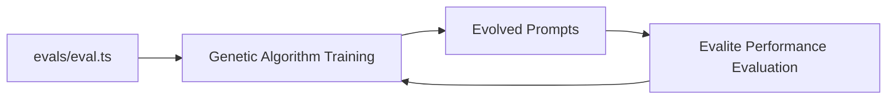

# Evals Directory

This directory contains evaluation configurations that serve as the **single source of truth** for all prompt evaluation logic in PromptGen.

## Purpose

The `evals/` directory defines evaluation logic that is used by **both**:

- **Genetic algorithm training** (automatic evaluation during evolution)
- **Manual testing** (standalone evaluation using Evalite framework)

Each eval includes:

- Test cases for evaluation
- Scoring functions
- Integration with Evalite framework

## Available Evals

- **intent-classification**: Classifies user intents (question, complaint, compliment, request, other)
- **article-summary**: Generates summaries of articles from the data/articles folder

## Directory Structure

```
evals/
├── README.md                           # This file
├── intent-classification/
│   └── intent-classification.eval.ts   # Intent classification evaluation
└── article-summary/
    └── article-summary.eval.ts         # Article summary evaluation
```

## How Evals Work

The `evals/` directory contains all evaluation logic and test cases using the Evalite framework:

1. **Evaluation Definition**: Each eval defines test cases, scoring functions, and evaluation logic using Evalite
2. **Genetic Algorithm Training**: The genetic algorithm uses the evaluation logic during evolution
3. **Built-in Scoring**: Uses autoevals library for standardized scoring metrics

### Workflow



**Key Point**: All evaluations use the Evalite framework with built-in scorers from the autoevals library, ensuring consistency and standardization across all tasks.

## Running Evals

To run evaluations:

```bash
# Run a specific eval with genetic algorithm evolution
npm run start --eval=<eval-name>

# Examples:
npm run start --eval=intent-classification
npm run start --eval=article-summary

# Run evals directly with Evalite (without genetic algorithm)
npm run eval

# Serve eval results
npm run eval:serve

# Watch for changes
npm run eval:watch
```

## Eval Structure

Each eval file should follow this structure:

```typescript
import { evalite } from "evalite";

evalite("Task Name", {
  data: testCases,
  task: async (input) => {
    // Prompt evaluation logic
    return result;
  },
  scorers: [
    {
      name: "accuracy",
      scorer: (output, expected) => {
        // Scoring logic
        return score;
      },
    },
  ],
});
```

## Evalite Framework Integration

All evaluations use the Evalite framework with built-in scorers from the autoevals library:

### Example: Article Summary Eval

```typescript
// evals/article-summary/article-summary.eval.ts
import { evalite } from "evalite";
import { Levenshtein } from "autoevals";
import fs from "fs";

// Load article files and create test cases
const articleFiles = ["climate-change.txt", "nutrition-guide.txt", ...];
const expectedSummaries = ["Climate patterns are changing...", ...];

export const testCases = articleFiles.map((filename, index) => {
  const content = fs.readFileSync(`data/articles/${filename}`, 'utf-8');
  return {
    input: content,
    expected: expectedSummaries[index],
    metadata: { filename }
  };
});

evalite("Article Summary", {
  data: testCases,
  task: async (input) => {
    // Prompt will be evolved by genetic algorithm
    const response = await openai.chat.completions.create({...});
    return response.choices[0]?.message?.content?.trim() || "";
  },
  scorers: [
    {
      name: "levenshtein",
      scorer: Levenshtein,
    },
  ],
});
```

### Built-in Scorers

Available scorers from the autoevals library:
- **Levenshtein**: Edit distance between strings
- **SemanticSimilarity**: Semantic similarity using embeddings
- **FactualityScorer**: Fact-checking and accuracy scoring
- **RelevanceScorer**: Relevance to the task
- **CoherenceScorer**: Text coherence and flow

### Results

Results are saved to `evalite-results/evolution-results.json` with:
- Best evolved prompts
- Hall of fame (top performing prompts)
- Evolution statistics
- Generation-by-generation progress

## Adding New Evals

To add a new eval:

1. Create a new directory under `evals/`
2. Add an `<eval-name>.eval.ts` file with evaluation configuration
3. Include test cases and scoring functions in the eval file
4. Run with: `npm run start --eval=<eval-name>`

## Scoring Functions

Common scoring functions include:

- **Accuracy**: Exact match scoring
- **Partial Match**: Partial credit for close matches
- **Semantic Similarity**: Using embeddings for semantic matching
- **Custom Metrics**: Domain-specific scoring
